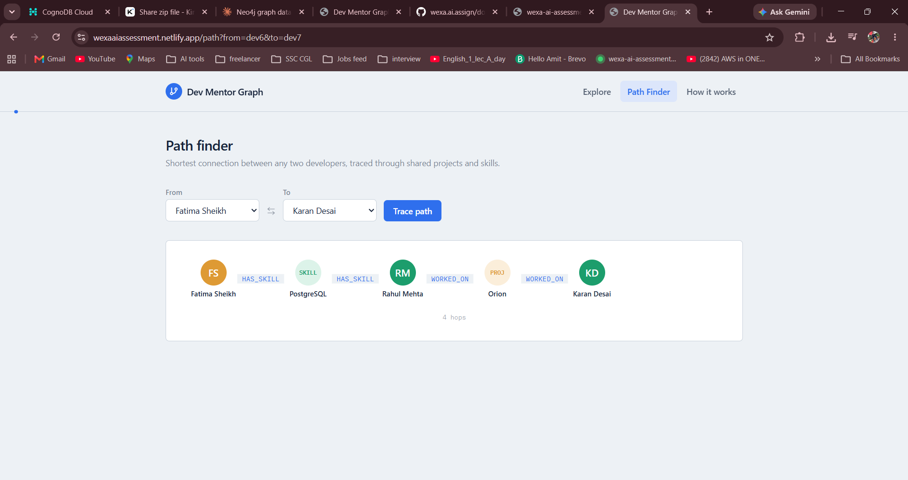
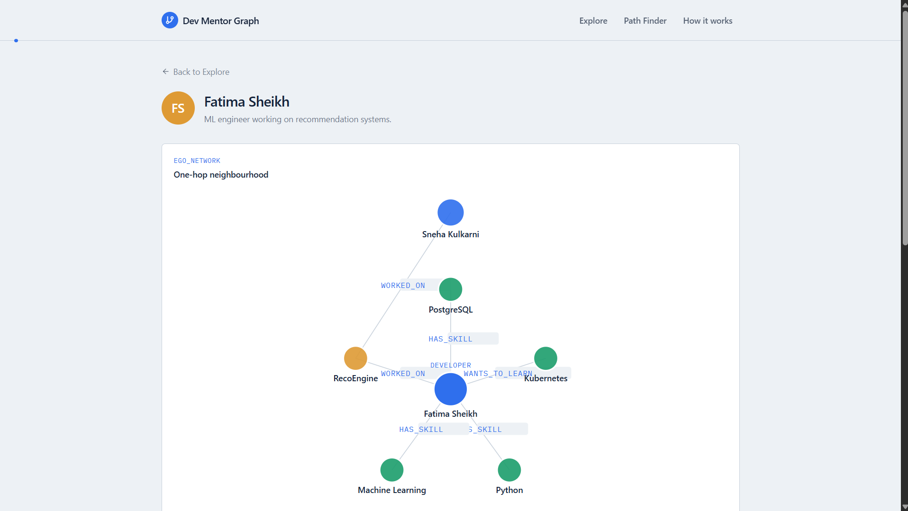
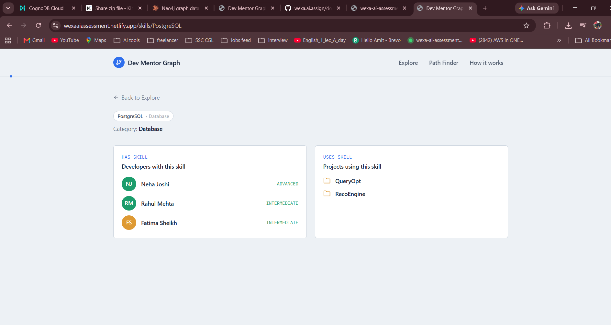

# Dev Mentor Graph — CognoDB Take-Home (Wexa AI)

A developer skill & mentor-matching application built on **CognoDB**, a managed graph
database that speaks openCypher over Bolt and works with the standard Neo4j drivers.
Built for the Wexa AI "Build a Graph Database Application" take-home assignment.

**Live demo:** _add your hosted URL here before submission_
**Screen recording:** _add your video link here before submission_

---

## Table of contents

- [Use case](#use-case)
- [Why a graph database?](#why-a-graph-database)
- [Data model](#data-model)
- [Tech stack](#tech-stack)
- [Screenshots](#screenshots)
- [Project structure](#project-structure)
- [Getting started](#getting-started)
- [API reference](#api-reference)
- [Cypher queries at a glance](#cypher-queries-at-a-glance)
- [Error handling](#error-handling)
- [Deployment](#deployment)

---

## Use case

**Dev Mentor Graph** models developers, the skills they have (or want to learn), and the
projects they've worked on, as a graph. Once that's in place, it can answer questions
that are naturally about _connections_ rather than _records_:

- "Who can mentor me in GraphQL, given people I've already worked with?"
- "Which developers should I meet — same skills, but we've never collaborated?"
- "How is developer A connected to developer B at all, through any shared project or skill?"

None of those are "list developers" or "filter by skill" queries a normal CRUD table
handles well. They're all traversal questions, which is exactly what a graph database
is built for.

## Why a graph database?

A relational schema _can_ model this (`developers`, `skills`, `projects`, and three join
tables), but the interesting queries fight the schema:

| Query                                                    | Relational approach                                                                  | Graph approach                                                             |
| -------------------------------------------------------- | ------------------------------------------------------------------------------------ | -------------------------------------------------------------------------- |
| Find a mentor through someone I already worked with      | 3–4 table JOINs across `worked_on` and `has_skill`, with a self-join on `developers` | One Cypher pattern, 2 hops                                                 |
| Recommend peers who share a skill but never collaborated | JOIN + a `NOT EXISTS` correlated subquery                                            | `NOT EXISTS { }` over a graph pattern, same shape as the rest of the query |
| Shortest connection between two arbitrary developers     | Recursive CTE with a manually bounded depth, awkward and slow to reason about        | `shortestPath()` — one line, unbounded depth handled natively              |

The shortest-path query is the clearest case: relational databases don't have a native
concept of "traverse until you find a path," so you either bound the recursion depth
by hand or accept a query that gets slower and uglier the more hops you allow. A graph
database walks relationships as pointers, so `shortestPath()` is native and cheap
regardless of how many hops it takes.

The trade-off is honest too: for the plain "list all developers" or "list all skills"
queries in this app, a relational table would have been perfectly fine — a graph
database doesn't win _every_ query, just the connection-shaped ones, which is why the
app is built around a handful of multi-hop queries rather than trying to force
everything through the graph.

## Data model

```
(Developer)-[:HAS_SKILL {level}]->(Skill)
(Developer)-[:WANTS_TO_LEARN]->(Skill)
(Developer)-[:WORKED_ON {role}]->(Project)
(Project)-[:USES_SKILL]->(Skill)
```

**Nodes**

| Label       | Properties                  |
| ----------- | --------------------------- |
| `Developer` | `id`, `name`, `bio`         |
| `Skill`     | `name`, `category`          |
| `Project`   | `id`, `name`, `description` |

**Relationships**

| Type             | Direction           | Properties                               | Meaning                            |
| ---------------- | ------------------- | ---------------------------------------- | ---------------------------------- |
| `HAS_SKILL`      | Developer → Skill   | `level` (beginner/intermediate/advanced) | developer's current skill          |
| `WANTS_TO_LEARN` | Developer → Skill   | —                                        | a learning goal                    |
| `WORKED_ON`      | Developer → Project | `role`                                   | developer contributed to a project |
| `USES_SKILL`     | Project → Skill     | —                                        | a project's tech stack             |

Seed data: 10 developers, 18 skills, 6 projects, and the relationships between them —
small enough to eyeball by hand, large enough that the multi-hop queries return
genuinely non-trivial results.

## Tech stack

- **Database:** CognoDB Cloud (managed graph DB, Bolt/openCypher, Neo4j-driver compatible)
- **Backend:** Node.js, Express, `neo4j-driver` (official Bolt driver)
- **Frontend:** React (Vite), React Router, Tailwind CSS v4, Axios
- **Hosting:** Render/Railway (backend), Netlify/Vercel (frontend)

See [`INTERVIEW_PREP.md`](./INTERVIEW_PREP.md) for a deep dive into how the driver
connects, what each query does, and the reasoning behind the architecture.

## Screenshots

| Explore developers                        | Path finder                        |
| ----------------------------------------- | ---------------------------------- |
|  |  |

| Ego network (one-hop neighbourhood) | Skill detail                        |
| ----------------------------------- | ----------------------------------- |
|   |  |

The original assignment brief is included at [`docs/assignment-brief.pdf`](./docs/assignment-brief.pdf).

## Project structure

```
Wexa_AI_assessment/
├── backend/                 Express API + neo4j-driver
│   └── src/
│       ├── config/db.js     driver setup, session helper, connectivity check
│       ├── controllers/     thin request handlers (asyncHandler + ApiError)
│       ├── services/        all Cypher lives here, one function per query
│       ├── routes/          Express routers
│       ├── middleware/      centralized error handler
│       ├── seed/            seed data + loader script
│       └── utils/           asyncHandler, ApiError, ApiResponse, serializers
├── frontend/                React (Vite) + Tailwind v4 + Axios
│   └── src/
│       ├── api/client.js    single axios instance + interceptors
│       ├── pages/           Explore, Developer profile, Skill/Project detail, Path finder
│       └── components/      shared UI (cards, panels, graph view, state views)
├── docs/                    screenshots + the original assignment PDF
├── README.md                you are here
└── INTERVIEW_PREP.md        CognoDB/Neo4j deep dive + likely interview questions
```

## Getting started

### 1. Provision CognoDB

1. Sign up at [console.cognodb.com](https://console.cognodb.com/signup) (free, no card).
2. Create a free **c0** instance and pick a region — provisions in under a minute.
3. Copy the connection URI (`bolt+s://<instance-id>.databases.cognodb.cloud`) and the
   generated password for user `cognodb`. **The password is shown once** — save it now.

### 2. Backend

```bash
cd backend
npm install
cp .env.example .env      # fill in BOLT_URI, NEO4J_USER, NEO4J_PASSWORD
npm run seed               # loads 10 developers, 18 skills, 6 projects
npm run dev                 # http://localhost:5000
```

`GET /health` reports database connectivity directly — hit it first to confirm the
driver can actually reach your instance before testing the rest of the API.

### 3. Frontend

```bash
cd frontend
npm install
cp .env.example .env      # point VITE_API_BASE_URL at your running backend
npm run dev                 # http://localhost:5173
```

Three pages: **Explore** (`/`, all developers, searchable), **Developer profile**
(`/developers/:id`, skills + the two graph-query panels), and **Path finder** (`/path`,
shortest path between any two developers).

## API reference

| Method | Path                                  | Purpose                                               |
| ------ | ------------------------------------- | ----------------------------------------------------- |
| GET    | `/health`                             | DB connectivity check                                 |
| GET    | `/api/developers`                     | list all developers                                   |
| GET    | `/api/developers/:id`                 | full profile (skills, wants, projects)                |
| GET    | `/api/developers/:id/graph`           | ego-network for the network visualization             |
| GET    | `/api/developers/:id/mentors`         | **multi-hop** — mentors for skills they want to learn |
| GET    | `/api/developers/:id/recommendations` | peers who share a skill but haven't collaborated      |
| GET    | `/api/graph/path?from=X&to=Y`         | **shortest path** between two developers              |
| GET    | `/api/skills`                         | list all skills                                       |
| GET    | `/api/skills/:name/developers`        | who has a given skill                                 |
| GET    | `/api/projects`                       | list all projects                                     |
| GET    | `/api/projects/:id/team`              | who worked on a project                               |

Every successful response is shaped `{ success: true, data, message }`; every error is
`{ success: false, message }` with a matching HTTP status code — see
[Error handling](#error-handling).

## Cypher queries at a glance

Full explanations, including why each pattern is written the way it is, live in
[`INTERVIEW_PREP.md`](./INTERVIEW_PREP.md). Short version:

- **Mentor matching** (3 hops): `WANTS_TO_LEARN` → shared `WORKED_ON` project →
  `HAS_SKILL` on the target skill.
- **Peer recommendations**: shared `HAS_SKILL`, filtered by a `NOT EXISTS` subquery so
  it excludes anyone already connected through a project.
- **Shortest path**: `shortestPath((a)-[:WORKED_ON|HAS_SKILL*..8]-(b))` — a
  variable-length, undirected traversal across two relationship types, capped at 8 hops.
- **Ego network**: `OPTIONAL MATCH` across all of a developer's relationships in one
  query, reshaped into `{ nodes, edges }` for the frontend graph view.

All queries are parameterised through the official driver (`tx.run(cypher, params)`) —
no string-concatenated Cypher anywhere in the codebase.

## Error handling

The backend never lets the database crash the process:

- `asyncHandler` wraps every controller so a rejected promise reaches Express's error
  middleware instead of the app hanging or crashing.
- `ApiError` lets a controller `throw new ApiError(404, "...")` and have the right
  status code and message come out the other end automatically.
- The central error handler special-cases Neo4j's own error codes
  (`ServiceUnavailable`, `SessionExpired`, `ConnectionTimeout`) into a `503` so the
  frontend can show "the database is unreachable" instead of a generic failure.
- The frontend's axios interceptor mirrors this — it unwraps `{ data }` on success and
  turns any backend error into a plain `Error` with a readable `.message`, so every
  page's `.catch()` already works without knowing about the response envelope.

## Deployment

Backend: any Node host (Render/Railway) — set `BOLT_URI`, `NEO4J_USER`,
`NEO4J_PASSWORD`, `CLIENT_ORIGIN` as environment variables, never commit them.
Frontend: any static host (Netlify/Vercel) — set `VITE_API_BASE_URL` to the deployed
backend URL. `netlify.toml` in `frontend/` already redirects all routes to
`index.html` for client-side routing.
